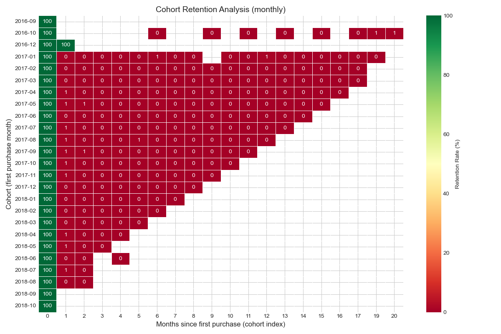

# Cohort Retention Analysis for E‑Commerce

**Project:** Customer retention analysis using cohort-based approach.

**Goal:** Understand how long customers stay active after their first purchase and identify retention patterns.

**Tools:** Python (pandas, matplotlib, seaborn), Jupyter Notebook

**Dataset:** Brazilian E‑Commerce Public Dataset (Olist) — 100k+ orders.

---

## 📊 Key Findings

| Time after first purchase | Retention Rate |
|---------------------------|----------------|
| 1 month                   | 5.2%           |
| 2 months                  | 0.3%           |
| 3 months                  | 0.3%           |
| 6 months                  | 0.3%           |

**Visualisation:** Cohort retention heatmap  


---

## 📌 Business Context

This dataset represents a **typical e‑commerce marketplace** selling durable goods (electronics, home appliances, etc.). Customers rarely need to repurchase the same category immediately.

**Therefore:**
- Low retention is **not a failure** — it's a feature of the business model
- **Customer acquisition** matters more than retention for this type of store
- Retention campaigns may have limited ROI unless the store introduces consumables or subscriptions

---

## 💡 Recommendations

| Focus Area | Action |
|------------|--------|
| **Acquisition** | Invest in marketing channels that bring new customers efficiently |
| **First‑time experience** | Optimise checkout and delivery to convert one‑time buyers into repeat customers |
| **Loyalty programme** | Consider a points‑based system or personalised offers for high‑value segments |
| **Product strategy** | Introduce consumables or subscription options to increase repeat purchase rates |

---

## 🛠️ Tools & Techniques

| Task | Tool / Library |
|------|----------------|
| Data loading & cleaning | pandas |
| Cohort grouping | pandas + datetime |
| Retention calculation | custom aggregation with `.pivot()` |
| Visualisation | matplotlib, seaborn (heatmap) |
| Development environment | Jupyter Notebook |

---

## 📂 How to Reproduce

1. Clone the repository:
   ```bash
   git clone https://github.com/leontiewaa/cohort-retention-analysis.git
2. Install dependencies:
    ```bash
    pip install pandas numpy matplotlib seaborn jupyter

3. Run 02_Cohort_Analysis.ipynb in Jupyter Notebook.